<div align="center">
  
  <h1>Whisperi</h1>
  <p><strong>Built on Windows, for Windows.</strong></p>
</div>

<p align="center">
  
  <p>A fast, modern desktop dictation app built with Tauri 2.x. Speak naturally and have your words transcribed, cleaned up, and pasted into any application — including CLI tools like Claude Code and Codex.</p>
</p>

## Paste Anywhere — Including CLI Tools

Most dictation apps on the market can only paste into standard GUI text fields. Whisperi uses native Win32 `SendInput` to simulate keystrokes, which means it can paste directly into **command-line interfaces and terminal emulators** — something most competitors cannot do.

This makes Whisperi especially useful for developers who work with AI coding assistants in the terminal:

- **Claude Code** — dictate prompts and instructions directly into the Claude Code CLI
- **Codex CLI** — speak your coding requests instead of typing them
- **Any terminal** — PowerShell, Windows Terminal, cmd.exe, WSL terminals

No need to type out long prompts manually. Just press the hotkey, speak, and your words appear right in the terminal input.

## Why Cloud-First?

Whisperi primarily relies on cloud transcription services (OpenAI, Groq, Mistral) rather than local models. While local speech-to-text models like whisper.cpp exist, they require significant computational resources to achieve acceptable speed and accuracy. For most users, cloud APIs deliver near-instant, high-quality transcription that local models on consumer hardware simply cannot match.

### Recommended Models

After testing across providers, the following combination delivers the best balance of speed and accuracy:

| Stage | Provider | Model | Why |
|-------|----------|-------|-----|
| **Transcription** | Groq | Whisper Large v3 Turbo | Fastest cloud transcription with excellent accuracy |
| **Enhancement** | Groq | LLaMA 3.3 70B | Best speed-to-quality ratio for text cleanup |

Both models run on Groq's inference engine, so you only need a single API key. Transcription + enhancement typically completes in under 2 seconds end-to-end.

If you need more sophisticated enhancement (complex restructuring, tone adjustments, or nuanced formatting), you can switch to **LLaMA 4 Maverick** or **LLaMA 4 Scout** on Groq. These models produce higher-quality rewrites but take noticeably longer per request.

## Features

- **Terminal Paste** — Paste transcribed text directly into CLI tools (Claude Code, Codex, terminals) via native keystroke simulation
- **Voice Transcription** — OpenAI, Groq, and Mistral with model selection
- **Text Enhancement** — Post-process transcriptions with GPT, Claude, Gemini, or Groq models to clean up grammar, punctuation, and formatting
- **Auto-Paste** — Transcribed text is automatically copied to clipboard and pasted into the active window
- **Custom Dictionary** — Add names, jargon, and technical terms to improve accuracy
- **Agent Mode** — Say the agent name to switch from transcription cleanup to conversational AI
- **System Tray** — Runs quietly in the background with quick access via tray icon
- **Hotkey Support** — Tap-to-toggle or push-to-talk activation modes
- **Dark Mode** — Clean, minimal dark interface

### Overlay Button States

<p align="center">
  
</p>

## Language & Translation

Whisperi's language selector (Settings > General > Language) controls the **output language**, not the input language. This means you can speak in one language and have the output automatically produced in another.

- **Auto-detect** — output matches whatever language you speak
- **Specific language** (e.g., English) — output is always in the selected language, regardless of what language you speak

This effectively gives you real-time speech translation. For example, you can speak in Chinese and set the output language to English — Whisperi will transcribe your speech and produce clean English text. Or speak in English and output in French, Japanese, etc.

The language setting overrides the system prompt language, so even if you use a custom prompt written in Chinese, selecting English as the output language will produce English output.

## Contributing

### Prerequisites

- [Rust](https://rustup.rs/) (stable)
- [bun](https://bun.sh/)
- Windows 10/11 (primary target)

### Development

```bash
# Install dependencies
bun install

# Start dev mode (Vite + Tauri)
bun run tauri dev

# TypeScript typecheck
bun run typecheck

# Rust tests
cd src-tauri && cargo test

# Production build
bun run tauri build
```

## Supported Providers

### Voice Transcription
| Provider | Models |
|----------|--------|
| OpenAI | GPT-4o Mini Transcribe, GPT-4o Transcribe, Whisper |
| Groq | Whisper Large v3 Turbo |
| Mistral | Voxtral Mini |

### Text Enhancement
| Provider | Models |
|----------|--------|
| OpenAI | GPT-5.2, GPT-5.2 Pro, GPT-5 Mini, GPT-5 Nano, GPT-4.1 family |
| Anthropic | Claude Opus 4.6, Claude Sonnet 4.5, Claude Haiku 4.5 |
| Google Gemini | Gemini 3 Pro, Gemini 3 Flash, Gemini 2.5 Pro, Gemini 2.5 Flash |
| Groq | LLaMA 4 Maverick, LLaMA 4 Scout, Qwen3 32B, GPT-OSS 120B/20B, LLaMA 3.3 70B |

## Example Prompts

Whisperi supports custom system prompts to control how the AI cleans up your transcriptions. Example prompts are available in [`examples/prompts/`](../examples/prompts/):

- [`custom-prompt-en.txt`](../examples/prompts/custom-prompt-en.txt) — English
- [`custom-prompt-zh.txt`](../examples/prompts/custom-prompt-zh.txt) — Chinese (中文)

To use a custom prompt, go to **Settings > Enhancement > System Prompt**, switch to the **Custom Prompt** tab, and paste your prompt text.

## Other Platforms

Whisperi currently targets Windows only, but it is built with [Tauri](https://tauri.app/), which supports macOS and Linux as well. If you'd like to see support for other platforms, please [open an issue](https://github.com/xarthurx/whisperi/issues).

In the meantime, check out these cross-platform alternatives:

- [OpenWhispr](https://openwhispr.com) — cross-platform dictation tool
- [Whispering](https://github.com/EpicenterHQ/epicenter) — open-source speech-to-text

## License

This project is licensed under the MIT License — see the [LICENSE](LICENSE) file for details.
