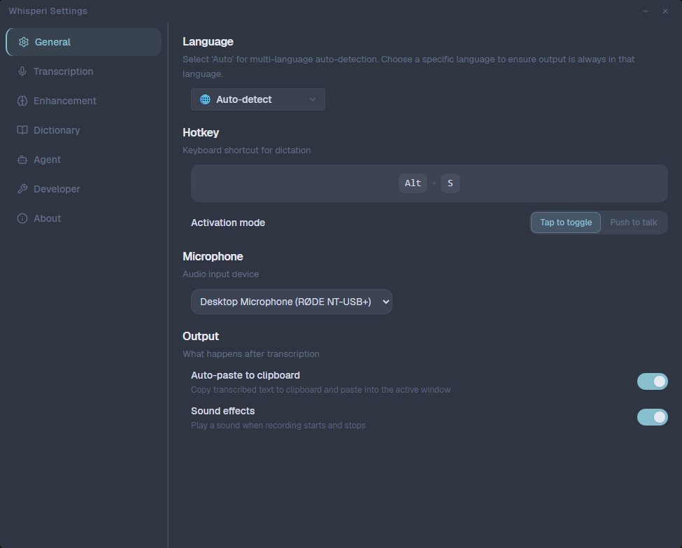

<div align="center">
  
  <h1>Whisperi</h1>
  <p><strong>Built on Windows, for Windows.</strong></p>
  <p>
    <a href="https://github.com/xarthurx/whisperi/actions/workflows/ci.yml"></a>
    <a href="https://github.com/xarthurx/whisperi/releases/latest"></a>
    <a href="https://github.com/xarthurx/whisperi/blob/main/LICENSE"></a>
    
    
  </p>
</div>

<p align="center">
  
  <p>A fast, modern desktop dictation app built with <strong>Tauri 2.x</strong>. Speak naturally and have your words transcribed, cleaned up, and pasted into any application — including CLI tools like <strong>Claude Code</strong> and <strong>Codex</strong>.</p>
</p>

## Why Cloud-First?

Whisperi primarily relies on **cloud transcription services** (OpenAI, Groq, Mistral) rather than local models. While local speech-to-text models like `whisper.cpp` exist, they require significant computational resources to achieve acceptable speed and accuracy. For most users, cloud APIs deliver **near-instant, high-quality transcription** that local models on consumer hardware simply cannot match.

See [Supported Providers](#supported-providers) for the full list of models and our recommended setup.

## Features

<p align="center">
  
</p>

- **Voice Transcription** — OpenAI, Groq, and Mistral with model selection
- **Text Enhancement** — Post-process transcriptions with GPT, Claude, Gemini, or Groq models to clean up grammar, punctuation, and formatting
- **Auto-Paste** — Transcribed text is automatically pasted into the active window, including [CLI tools](#paste-anywhere--including-cli-tools)
- **Custom Dictionary** — Add names, jargon, and technical terms to improve accuracy
- **Transcribe & Chat Modes** — Cleans up speech by default; say the agent name to switch to a conversational AI chatbot
- **Hotkey Support** — Tap-to-toggle or push-to-talk activation modes

## Language & Translation

Whisperi's language selector (**Settings > General > Language**) controls the **output language**, not the input language. This means you can speak in one language and have the output automatically produced in another.

- **Auto-detect** — output matches whatever language you speak
- **Specific language** (e.g., "English") — output is always in the selected language, regardless of what language you speak

This effectively gives you **real-time speech translation**. For example, speak in Chinese and set the output language to English — Whisperi will transcribe your speech and produce clean English text. Or speak in English and output in French, Japanese, etc.

> The language setting overrides the system prompt language — even if your custom prompt is written in Chinese, selecting "English" as the output language will produce English output.

<p align="center">
  
</p>

## Paste Anywhere — Including CLI Tools

Most dictation apps can only paste into standard GUI text fields. Whisperi uses native Win32 `SendInput` to simulate real keystrokes, which means it can paste directly into **command-line interfaces** and **terminal emulators** — something most competitors simply cannot do.

This makes Whisperi especially useful for developers who work with AI coding assistants in the terminal:

- **Claude Code** — dictate prompts and instructions directly into the Claude Code CLI
- **Codex CLI** — speak your coding requests instead of typing them
- **Any terminal** — PowerShell, Windows Terminal, cmd.exe, WSL terminals

> No need to type out long prompts manually. Just press the hotkey, speak, and your words appear right in the terminal input.

## Supported Providers

### Recommended Models

After testing across providers, the following combination delivers the best balance of speed and accuracy:

| Stage             | Provider | Model                  | Why                                                 |
| ----------------- | -------- | ---------------------- | --------------------------------------------------- |
| **Transcription** | Groq     | Whisper Large v3 Turbo | Fastest cloud transcription with excellent accuracy |
| **Enhancement**   | Groq     | LLaMA 3.3 70B          | Best speed-to-quality ratio for text cleanup        |

Both models run on Groq's inference engine, so you only need **a single API key**. Transcription + enhancement typically completes in **under 2 seconds** end-to-end.

If you need more sophisticated enhancement (complex restructuring, tone adjustments, or nuanced formatting), switch to **LLaMA 4 Maverick** or **LLaMA 4 Scout** on Groq. These models produce higher-quality rewrites but take noticeably longer per request.

### Voice Transcription

| Provider | Models                                             |
| -------- | -------------------------------------------------- |
| OpenAI   | GPT-4o Mini Transcribe, GPT-4o Transcribe, Whisper |
| Groq     | Whisper Large v3 Turbo                             |
| Mistral  | Voxtral Mini                                       |

### Text Enhancement

| Provider      | Models                                                                      |
| ------------- | --------------------------------------------------------------------------- |
| OpenAI        | GPT-5.2, GPT-5.2 Pro, GPT-5 Mini, GPT-5 Nano, GPT-4.1 family                |
| Anthropic     | Claude Opus 4.6, Claude Sonnet 4.5, Claude Haiku 4.5                        |
| Google Gemini | Gemini 3 Pro, Gemini 3 Flash, Gemini 2.5 Pro, Gemini 2.5 Flash              |
| Groq          | LLaMA 4 Maverick, LLaMA 4 Scout, Qwen3 32B, GPT-OSS 120B/20B, LLaMA 3.3 70B |

## Example Prompts

Whisperi supports custom system prompts to control how the AI cleans up your transcriptions. Example prompts are available in [`examples/prompts/`](../examples/prompts/):

- [`custom-prompt-en.txt`](../examples/prompts/custom-prompt-en.txt) — English
- [`custom-prompt-zh.txt`](../examples/prompts/custom-prompt-zh.txt) — Chinese (中文)

To use a custom prompt, go to **Settings > Enhancement > System Prompt**, switch to the "Custom Prompt" tab, and paste your prompt text.

## Other Platforms

Whisperi currently targets **Windows only**, but it is built with [Tauri](https://tauri.app/), which supports macOS and Linux as well. If you'd like to see support for other platforms, please [open an issue](https://github.com/xarthurx/whisperi/issues).

If you need **local/offline transcription** (no cloud API keys), check out these alternatives that bundle Whisper models for on-device processing:

- [OpenWhispr](https://openwhispr.com) — cross-platform dictation with local and cloud models
- [Epicenter (formerly Whispering)](https://github.com/EpicenterHQ/epicenter) — local-first open-source speech-to-text ecosystem

## Contributing

**Prerequisites:** [Rust](https://rustup.rs/) (stable), [bun](https://bun.sh/), Windows 10/11

```bash
bun install              # install dependencies
bun run tauri dev        # dev mode (Vite + Tauri)
bun run typecheck        # TypeScript check
cd src-tauri && cargo test   # Rust tests
bun run tauri build      # production build
```

## License

This project is licensed under the MIT License — see the [LICENSE](LICENSE) file for details.
